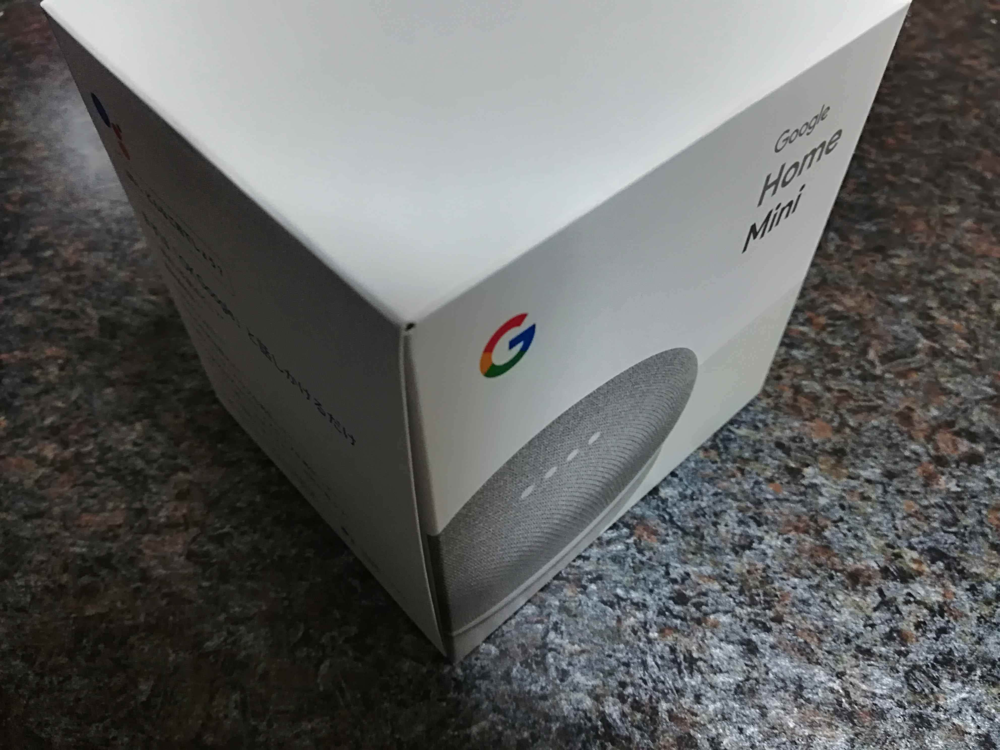
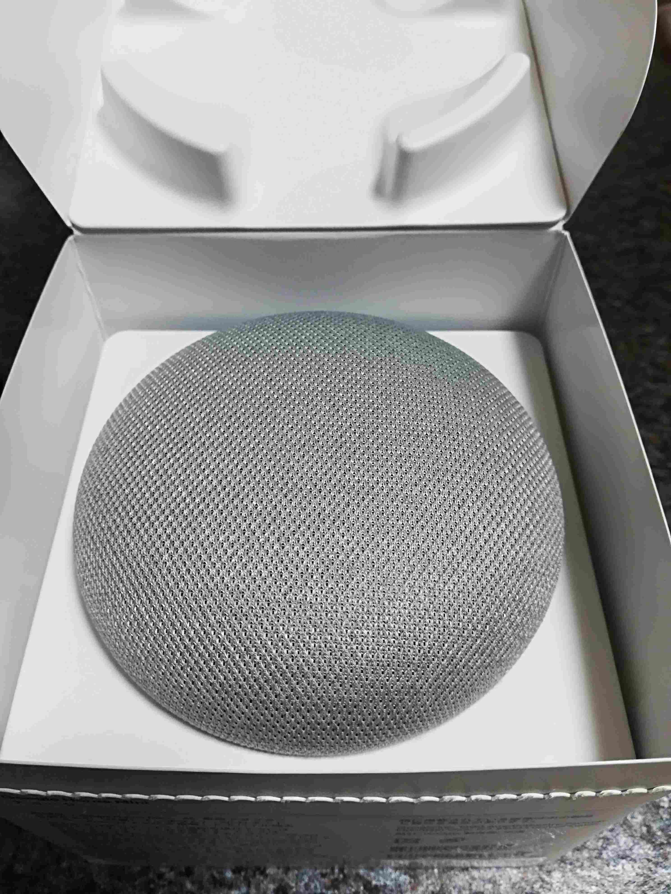
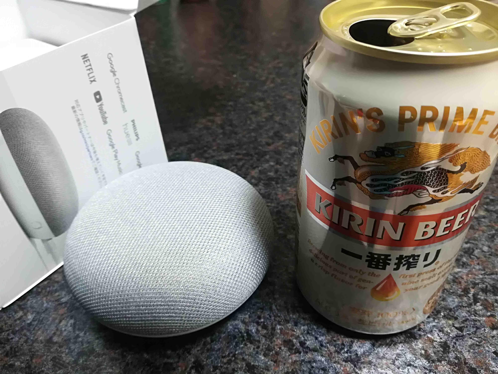
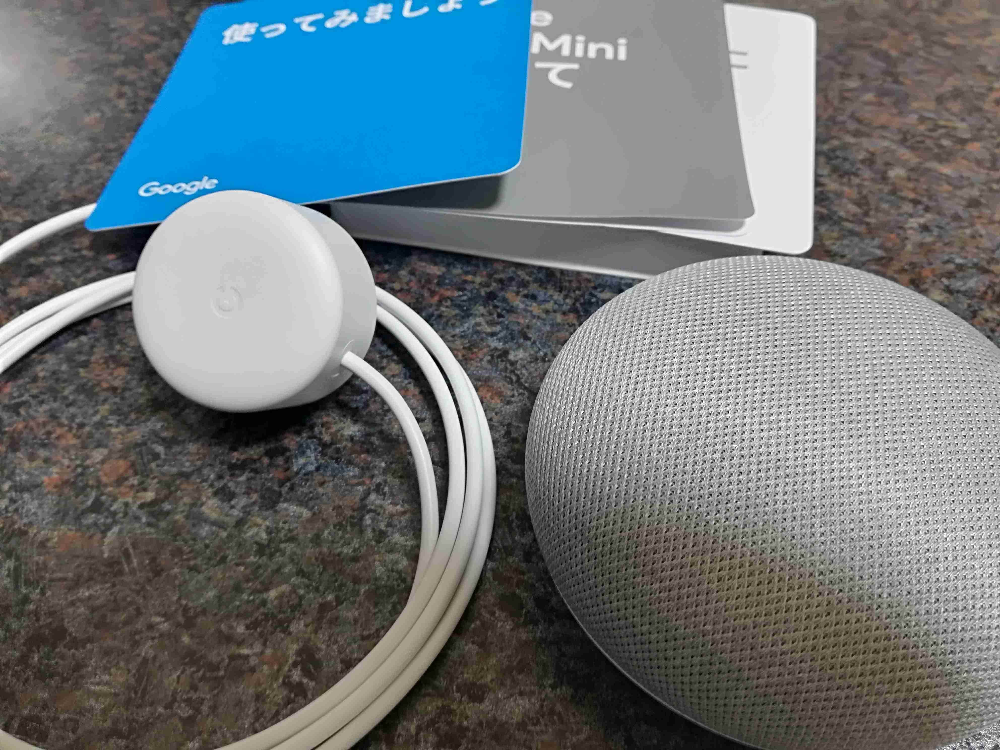
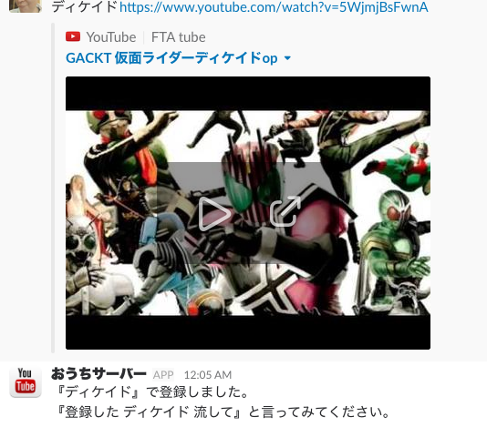

ついに我が家にも話題の家電 Google Home が到着しました！  
と言っても来たのは 2 週間前ですしミニの方なんですが、せっかくなので使用感も合わせて記事にしたいと思います(･∀･)

## 購入経緯

元々特に購入予定もなかったのですが、たまたま入った家電量販店で半額セールをやっていたため、購入に踏み切りました(`･ω･´)  
3,000 円なら買いなんじゃないでしょうか？

ということで我が家にも到着です♪

こんな感じです(^ω^;)  
まぁ皆さん家電量販店やネットでも散々見てるとは思いますが…

## 開封の儀

せっかくネット記事なので、それっぽいことをやってみますwww  
全体を覆うビニールを裏側からペリペリしてパカッ！

ほぅ…

## サイズ感チェック

お隣のキリンさんのビールは 350ml 缶です。（空いてるのは気にしなくて OK です。。）

どうでしょう？  
個人的には思ったより小さいな〜という感じです(*･ω･)ﾉ

## 全部出してみる

内容はこんなもんです。。。

電源と簡単な説明書が入ってるのみΣ(･ω･ﾉ)ﾉ  
ここは Google らしいと言うか、海外製品らしいと言ったところでしょうか？

## 使用感

我が家は Wi-Fi がステルスなので、一時的にオフにして接続します。  
そしていよいよ話してみます(๑•̀ㅂ•́)و✧

- 自分「ねぇ、Google」
- Google Home「…（光るだけ）」
- 自分「あれ？光るだけなんだ〜」
- Google Home「すみません、よく分かりません。」
- 自分「…」
- これが最初の会話でした(´･ω･`)

## しばらくの使用

- 自分「ねぇ、Google。今の気温は？」
- Google Home「7℃です。」
- 自分「ねぇ、Google。豆知識。」
- Google Home「こんなのはどうでしょう？〜〜〜〜」
- 自分「…」

う〜ん、使いきれてない感がすごい… 
音楽も無料アカウントだと思ったようには流れてくれません(>_<)  
もっと調べることにしました。

## IFTTT との連携

いいツール見つけました♪ ←（遅い）  
家では元々 Raspberry Pi を使ってエアコンやこたつといった家電を操作できるようにしていましたので、WebHook 用の API を追加して動かせるようにしてみます(^^)v

- 自分「ねぇ、Google。暖房。」
- Google Home「はい、少々お待ちくださいませ。」
- （WebHook であることと、エアコンは赤外線量が多いのもあって、送信まで時間がかかる。）
- Google Home「暖房を点けました。なお、暖房を22℃で点けました。」
- 自分「ｷﾀ━━━(ﾟ∀ﾟ).━━━!!!」

ちなみに「暖房を点けました。なお、暖房を 22 ℃で点けました。」は API 側で google-home-notifier を使って喋らせています！
こんな感じでこたつも起動させることができました♪

さらに Raspberry Pi に用意していた機能と合わせて

- 平日の朝は電車の運行状況と 5 分おきに現在時刻を喋らせる。
- 「いってきます」で家電の OFF

なんてことまでできるようになりました(^w^)

## 調子にのってみる

我が家では会話に無料版の Slack を使っていますが、それを使ってさらに機能追加します！  
どんなことをやったかと言うと

- Raspberry Pi に youtube-dl 導入
- Slack の OutgoingWebhooks で Raspberry Pi にテキストを送信
- Raspberry Pi でテキストを解析して youtube-dl を実行し MP３ で保存
- MP3 の URL を DB に登録
- IFTTT に呼び出し用のレシピを追加

という感じです。  
そうです、Youtube の音楽を自身で再生させるようにするのです(`･ω･´)  
家の特定のチャンネルにタイトルと URL を流すと保存してくれます(^皿^ )

仮面ライダー好きは放っておいてください…。。  
これで「ねぇ、Google。登録したディケイド流して。」と言えば、音声を元に DB から MP3 の URL を引っ張ってきて google-home-notifier に食わせて音楽を流してくれるようになります(≧▽≦)  
これが我が家では結構好評で、いろんな音楽を登録しては流して楽しんでます♪

あとは音が良くなるとベストなのですが、取り敢えず今はイコライザの設定のみにしています。  
「半額だから」という衝動買いでしたが、あっという間に我が家にはなくてはならないものに進化しました(･∀･)  
今後も色んな機能を少しづつ追加して、より便利なツールにしていきたいと思います！