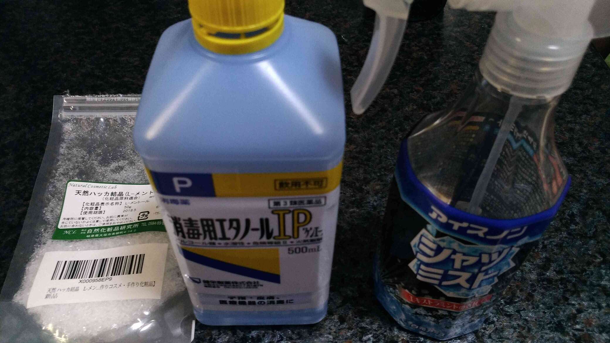
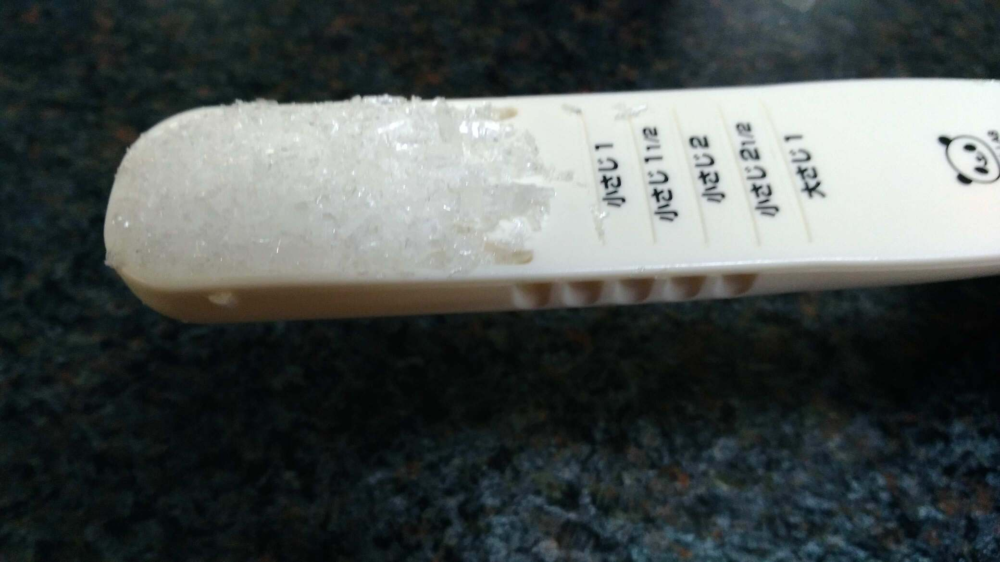
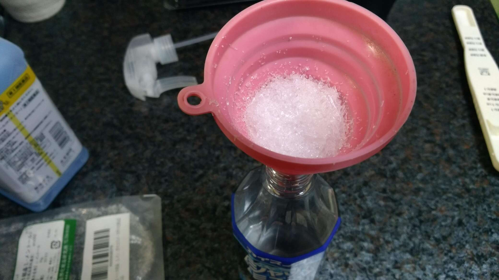
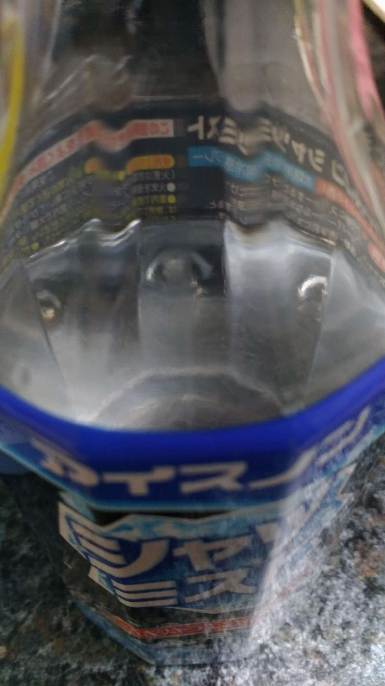
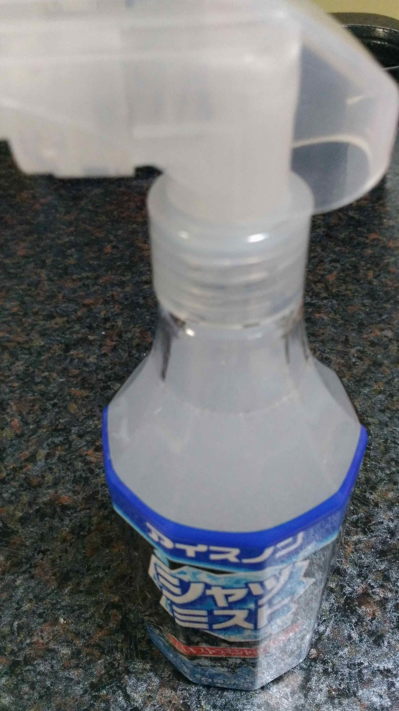

年も暑い夏でしたね…  
まだまだ残暑が厳しいです(>_<)  
なので通勤中はシャツミスト系が大変重宝します(･∀･)

ただ、これの販売期間が 5 月末 〜 9 月中旬という世知辛さΣ(･ω･ﾉ)ﾉ  
去年は販売終了間近に大量買いしたのですが、毎年それはちょっとしんどい…  
ということで自作できないか調べてみたところ、メンソールとアルコールがあればできるようなので試行錯誤(`･ω･´)  
上手くできたので記事にしようという感じです♪

<h4><strong class="dark-red">※ 実施は自己責任でお願いいたします<(_ _)></strong></h4>

## 準備

ということで、早速以下を準備します(*･ω･)ﾉ

- [【第3類医薬品】消毒用エタノールIP「ケンエー」500mL](https://amzn.to/2KQRuiO)
- [アイスノン シャツミスト エキストラミントの香り 300ml](https://amzn.to/2s4NXXd)（の空容器）
- [L-メントール（メントールクリスタル） 100g](https://amzn.to/2s52SAF)

シャツミストは空容器でいいので、無い場合は300ml程度のスプレーできる容器を用意しましょう！  
リンクにもある通り、全てAmazonで揃えられます♪

## 作成

まず、大さじ 2 杯のメンソールを…

こんな感じでじょうごにセット(*･ω･)ﾉ

ここにエタノールを 150ml 程度、メンソールが全て入るように少しずつ注ぎます(^^)  
なお、これは正確に 150ml でなくてよいです。  
500ml で 3 回できると思ってください。

注ぎ切れたら軽く振り、一晩放置します(･∀･)  
大体 2 時間もすれば全て溶けきると思いますが、念のため一晩おくとよいと思います。

最後に水道水で満たし、軽く降って混ざれば出来上がりです(≧▽≦)

使用感としては、冷たさはおおよそ同じくらいかと思います♪  
でも欠点もあって

- 実際のシャツミストよりも効いてる時間が短い
- シャツミストは比較的無臭なのに対し割とハッカ臭が強い
- 誤って空中に噴射すると少し目が痛い(´；ω；`)

というデメリットがあります。。。  
とは言え

- 値段を抑えたい
- 販売期間外に使いたい
- 自作でもっと強力なのを使いたい

という方にはオススメできるんじゃないかと思います！  
厳しい残暑も乗り切っていきましょう(๑•̀ㅂ•́)و✧