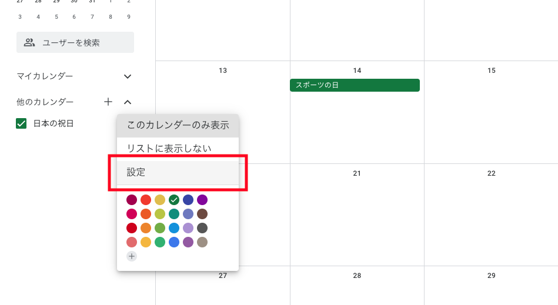
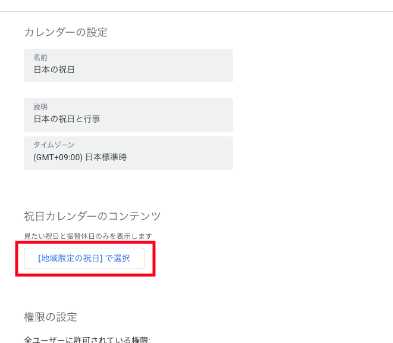
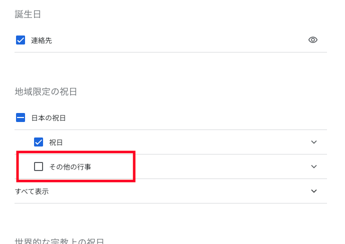

1ヶ月ほど前から Google カレンダーの日本の祝日カレンダーに含まれる祝日が変わったことに気が付きました。  
例えば七五三や節分といった、法律上の祝日ではない日までカレンダーに表示されるようになったようです(^^;  
今回はこれまで通り日本の公式の祝日のみ表示する方法をご紹介します！

## Web の Google カレンダー

インポートしている祝日カレンダーの三点リーダー「⋯」から設定に遷移します→

遷移先の「【地域限定の祝日】で選択」を選択して、対象の祝日を選択する画面に遷移します→

「その他行事」というのにチェックが入っているので、こちらのチェックを外せば表示されなくなります(*･ω･)ﾉ

## Google Calendar API で取得するカレンダー

Google Calendar API の場合、URL が少し変わります！

- 祝日およびその他行事
  - `ja.japanese#holiday@group.v.calendar.google.com`
- 祝日のみ
  - `ja.japanese.official#holiday@group.v.calendar.google.com`

`official` を付ければ良いようです(^^)  
先人たちに助けられました<(_ _)>

ちなみに私はこれまで `japanese__ja@holiday.calendar.google.com` という URL を利用していたのですが、こちらの形式のパターンの変更例は分からずでした…

## PHP から Google Calendar API を利用する

GAS の例は見かけましたが、PHP だと見当たらなかったので掲載しておきます！

### ちょっと解説

`$country_code` としていますが、海外の祝日カレンダーを利用する場合はこちらになります！  
例えば日本なら `japanese` ですし、アメリカなら `usa` となります(･∀･)

また、そのままだと `htmlLink` や `created` が入ってきてしまうので `日付 => 名称` の形式にしています。  
そして日付が降順になるように並び替えたら完成です(`･ω･´)  
このあたりはお好みで変えてください！

## まとめ

公式の祝日だけを Google カレンダーに表示することで、余計なイベントを減らし、スッキリとしたカレンダー管理ができるようになります(･∀･)  
どなたかの参考になれば幸いです。