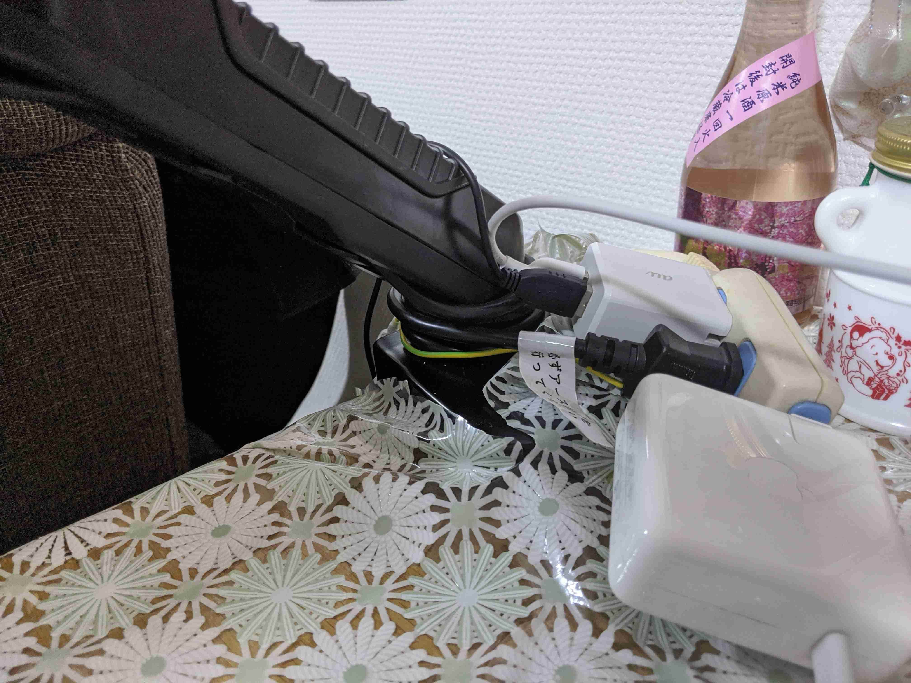

転職してしばらくはバタバタしておりましたが、やっと落ち着いてきました！  
そうこうしているウチにリモート中心の生活になってましたが、私個人だけで言えば比較的早めにリモートワークの準備できていてよかったです。。。  
さて、今回はそんな私のリモート環境を参考までに紹介させていただければと思います(*･ω･)ﾉ

### 全体…

タイトル画像の通りです(･∀･)  
よいか悪いか、めっちゃボケてますね。。。  
自鯖でアップロードした画像を圧縮するスクリプトが動いているのですが、imagejpeg は微妙なのかな？  
サムネイルを作るのにも重宝しているのですが…

気を取り直して、それぞれ使っているのを紹介させていただきます(๑•̀ㅂ•́)و✧

### 椅子 [Hbada](https://amzn.to/3wEcvdM)

いろんな方が、椅子はいいのを買った方がいいとおっしゃってます。  
取り敢えずだったので、安くて良さそう程度で買いました(^^;  
私はそこまで悪い商品には感じてないですね(･∀･)  
好きな角度に調整できるだけでリクライニング機能はないですが、意外とやってみるとリクライニング機能って使わないものです。。。

### モニター [Acer ET241Ybmi](https://amzn.to/3T2Zamz)

これまで家の開発だけなら 13 インチの Macbook Pro オンリーでやってたのですが、さすがに資料を開いたり Slack を開いたりもあるので、モニターを買いました！  
理想は 32 インチくらいですが、さすがに家のテーブルに付けるには大きすぎるため、23.8 インチにしました。。。  
でも結構満足しています！

### [モニターアーム HUANUO](https://amzn.to/48G08en)

上記のモニターと家のテーブルを取り付けるためですね！  
取り付けにはやや力が必要ですが、特に問題なくしっかり支えてくれています(^^)  
やや強引に取り付けましたが、逆にダイニングで Youtube 等を見れるようになったと妻も喜んでいるので、OK としたいと思います。

### ヘッドセット [Bengoo ps4](https://amzn.to/49FEpEP)

特段コダワリがあったワケでも光ってるのがいいとかでもなく、ヘッドセットで安いのを探してたらこれかな？となった程度です…  
でも思ってたよりも音質は良く、クリアに聞こえます(≧▽≦)  
強いて言えば、重低音をこのヘッドセットで聴くと本体が振動して耳が痒くなりますw

しばらくはフルリモートが続きそうなので、健康面も気をつけながら過ごしていきたいと思います(*･ω･)ﾉ