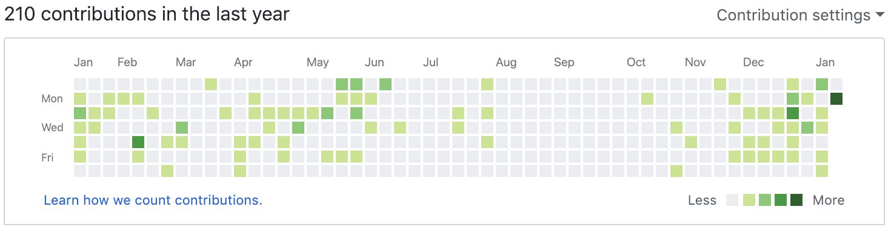

すっかり更新が止まってしまっています。。。  
今年はなるべく書けるようにしていきたい…と思います(´･ω･`)  
取り敢えず新年一発目なので、地味に[本人について](/person/)や[アカウント](/account/)、トップ画像なんかも変えましたww

さて、ご存知のように 2019/1/7 から GitHub の Private Repository が無料になりました！  
ありがたいですね〜(^^)  
以前、7＄払ってでも草を生やそうかな？なんて思っていた私にとっては朗報です！

## Bitbucket からの移行作業

ということで、早速移行作業をしていきます！  
Import repository を使えば Bitbucket からスムーズに移行できる…という記事を見たのですが、待てど暮らせど移行されず…(T_T)  
URL でも間違ってたのでしょか？  
結局、以下の手順でリポジトリの移行を行いました。

```
git clone git@bitbucket.org:<ユーザー>/<BitbucketのURL>.git
git remote set-url origin git@github.com:<ユーザー>/<GitHubのURL>.git
git push -u origin master
```

まぁ確実ですね(^ω^;)

## Pipelines から CircleCI へ

これまで CI は Bitbucket の Pipelines を利用していたのですが、GitHub には同等と機能がないので移行します。  
たとえば Android の場合、bitbucket-pipelines.yml の場合は上下のように

<script src="https://gist.github.com/bvlion/25d4a842fa2c0c36902edfa24df42a75.js"></script>

という感じで、色んなサイトを参考に書きました(･∀･)  
まだ使ったばかりなので詳細までは分かっていませんが、CircleCI を使ってみた感想としては

- やっぱりキャッシュ機能がありがたい（2 回目から早い）
- 書き方が結構柔軟
- SSH キーの登録が楽（Pipelines の仕様が分かってなかっただけですが…）

などがあるかと思います(*･ω･)ﾉ  
Bitbucket でも使えるので、最初から使っていればよかったかもしれませんね。。。

## 所感

やっぱり草みたいにビジュアルでコミットっぷりが見れるのは楽しいですね♪  
実際インポートしてみると、ぼちぼち個人アプリにはコミットしていたことが分かります(^皿^ )



去年の8 月、9 月は何で全然コミットしてなかったんだろう…  
一先ず必要なものは移行ができたので、これからは GitHub メインで使っていければと思います(`･ω･´)