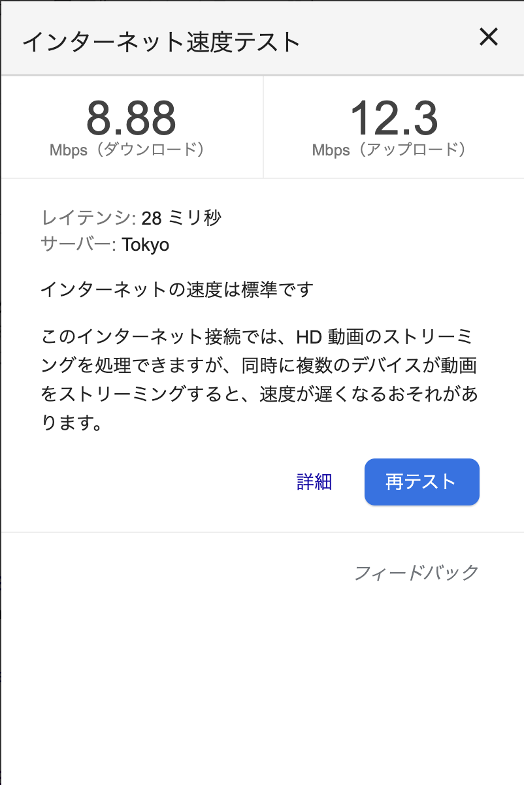
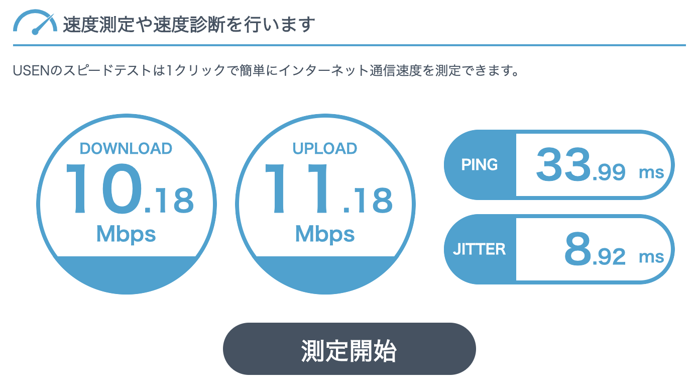
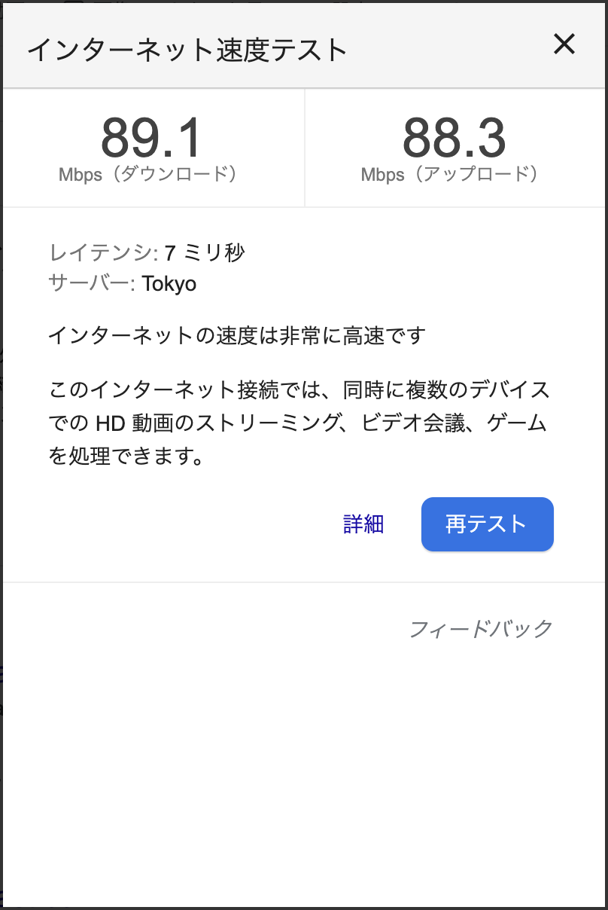
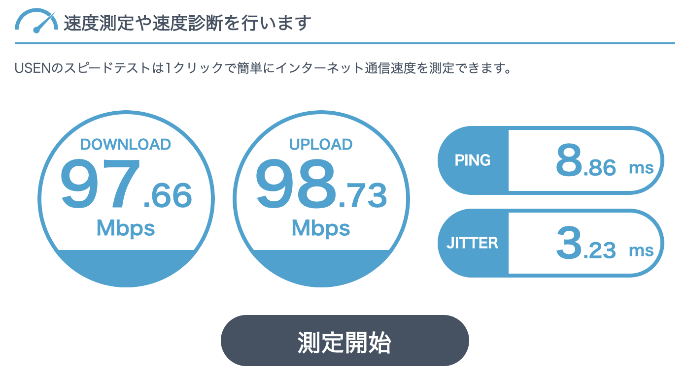

最近定期的に更新できていますね！（自分でもちょっと嬉しい）  
往復 1時間ちょっとの通勤の時間がないのは大きそう…

先日の「[書斎（スペース）ができました！](../study_space/)」の最後でもチラッと触れましたが、今更ながら IPv6 を導入しました(･∀･)  
そもそもこういったネットワーク周りが大変弱く何のこっちゃ状態ではありましたが、無事にそこそこの速度を叩き出せてるっぽいです！

## 導入前後の比較

ということで、まずは導入前後の速度比較から…  
上が導入前、下が導入後です！

Google | Usen
--- | ---
 | 
 | 

こういう速度測定がどの程度信頼できるものか分かりませんが、我が家は[フレッツ 光ネクスト マンションタイプ](https://flets.com/next/mn/)で上下とも最大 100Mbps というのを考えると、ほぼフルパワーで通信できているんじゃなかろうかと思います(≧▽≦)  
出るものなんですねぇ…

## 導入内容

今回導入したサービスは、インターリンクさんの「[ZOOT NATIVE](https://www.interlink.or.jp/service/zootnative/)」です。  
元々 [ZOOT NEXT](https://www.interlink.or.jp/service/flets/b/) には加入していて、加入当初は速度もよく固定 IP を便利に利用させていただいていたのですが、このタイミングで在宅の方が増えると徐々に速度の低下がっ(>_<)  
他サービスでも良かったのですが、2ヶ月試せるのと元々利用していたサービスだったので使ってみました！

あまり詳しくは分からないのですが、 DS-Lite 対応ルーターなるものが必要らしく、[NEC Aterm WG1200HP3](https://amzn.to/3eoVmWN) を購入しました(*･ω･)ﾉ  
こちらを元々 ZOOT NEXT に接続しているルーターに有線で繋げます。  
[こちらの「構成例2-1）」](https://faq.interlink.or.jp/faq2/View/wcDisplayContent.aspx?id=480)（2 段目）と同等ですね(･∀･)  
特に何もせず自動設定で繋げただけで IPv6 と IPv4 両方で接続され、上記の速度が出るようになりました！  
自動設定ホント神・・・

## 体感

動画とかダウンロード、それに仕事で利用している Zoom あたりはかなり快適になりました！  
あと Youtube で 4K 動画が見れたのはなかなかに感動ものでしたね〜  
ただネットサーフィンはあくまでも相手もありますので、そこまで劇的にめっちゃ速くなった感はないかも？  
[阿部寛さんの HP](http://abehiroshi.la.coocan.jp/) は IPv4 の頃から爆速ですw

## 今後

特に不満もないので、このまま来月からは課金しようと思います！  
Nuro も少し気にはなったものの、取り敢えず私はこれで満足です(๑•̀ㅂ•́)و✧  
遅くなったりしたらまた記事にしたいと思います。
