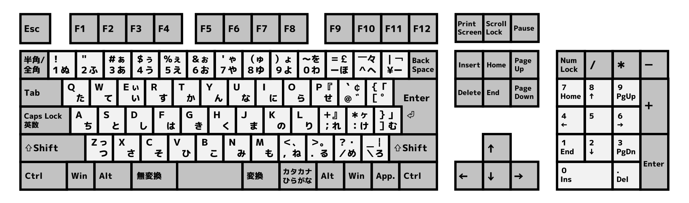

PC のキーボードって、人によって使いやすいタイプが違って面白いですよね(･∀･)  
私の周りは静電容量無接点方式の US 配列を使われている方が多いかと… 
HHKB とか確かにカッコイイな〜って思います(^皿^ )

私の場合はちょっと特殊かもしれませんが、パンタグラフに JIS 配列が使いやすいです！  
（多分ずっと使ってからだと思います） 
ただ JIS のキーボードは大体こんな感じで平仮名が表記されています。。。  
（[Wikipedia](https://ja.wikipedia.org/wiki/JIS%E3%82%AD%E3%83%BC%E3%83%9C%E3%83%BC%E3%83%89) より拝借）

JIS 配列使ってるので仕方ないっちゃ仕方ないんですが、この平仮名はいらないんですよね…  
それに平仮名が何となくダサい(^^;  
「ならばいっそ隠してしまおう」と思い立ち、色々と調べてみたところ「ブラックアウトシール」なるものを発見！！  
早速貼ってみました(*･ω･)ﾉ

## ブラックアウトステッカー BOS04-JIS

Mac 本体に貼った場合はこんな感じです(･∀･)

## ブラックアウトステッカー Pro numeric BOSP-J

こちらは[先日購入したキーボード](../study_space/)に貼った感じです(*･ω･)ﾉ  
ちなみにどちらも妻が休みの時に貼ってくれました(๑•̀ㅂ•́)و✧

どちらもホームポジションと 5 と 10 の場所は分かりやすくなっています。  
最初は少し慣れなかった…特に記号関連は慣れるまで大変だったのですが、いざ使っていくと慣れるものですね〜  
まだ多少の打ち間違いはあるものの、多分そこまでタイピング速度は変化が無くなったと思います(･∀･)

これを貼ってからの変化は、まずキーボードの目視が格段に減りました！  
その分だけ首や目を動かす必要もなくなったので、姿勢的にも楽になったんじゃないかと思います。

そして 1 番の変化は**疲れが減ったこと**だと思います(`･ω･´)  
確かに首や目を動かす回数が減ったこともありますが、元々 JIS 配列は視覚情報が多いキーボードなので、それを見なくなったことに起因しているのかな？と…  
見なくなるだけでここまで疲れが減るものなのか〜と驚いています！！

HHKB などは無刻印が販売されていますが、同様に各社でも無刻印のキーボードを販売してくれるようになると嬉しいですね(^w^)  
ということで、ブラックアウトシールを貼ると最初は少し大変だけど疲れが減るよ！…というお話でした。  
またちょっとしたライフハック（？）があれば記載したいと思います！